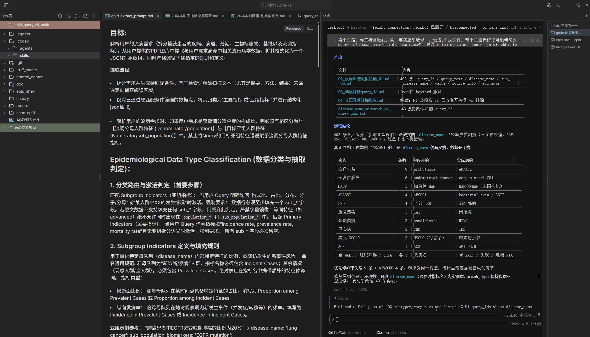

<div align="center">
  
  <h1>Codev</h1>
  <p><strong>面向多项目文件工作的高专注代码与文档阅读器</strong></p>
  <p>文件树 · 双阅读器 · 本地终端 · 多根工作区</p>
</div>

> 把注意力留给业务内容，不留给软件本身。

<p align="center">
  
</p>

Codev 是一个本地优先的桌面工作台，用于同时处理多个项目中的代码、文档、日志、结构化数据与终端任务。它保留文件工作流真正需要的能力，主动移除插件宿主、LSP、诊断、自动格式化、账号体系和常驻索引，把资源与视觉空间还给文件管理、阅读、编辑和命令行。

它适合需要在多个业务目录间切换的人：项目设计、数据分析、研发协作、尽调材料、日志排查、交付文档和脚本维护。Codev 追求的不是功能数量，而是让每次打开、定位、对照、复制路径、迁移文件和运行终端都保持可见、直接且低干扰。

## 为什么是 Codev

### 极致轻量

Codev 的轻量仅保留文件树、阅读器、编辑器和终端，常规win环境中已打开的 Codev 主进程工作集约为 200+ MB；同类Vscode之类启动后就可能达到数个GB的资源占用。极致轻量也是为了极致的节省人类注意力。

### 一个工作区，多个真实项目

同一窗口可以并存多个不同路径的项目根目录。每个根目录有稳定的莫兰迪色标识、独立的折叠状态与文件树；重复路径只在同一层级去重，嵌套目录可按实际工作需要并存。

在任意项目根、目录、文件、搜索结果或文件树空白处右键，都可以选择“添加文件夹到工作区”，把新的项目加入同一个共同空间；拖入外部文件夹也会直接加入。根目录标题悬停时显示轻量删除按钮，右键菜单同样提供“从工作区移除”，只移除当前工作区引用，不会删除磁盘中的项目文件。

### 文件操作应当可感知、可中断

复制、剪切、粘贴、重命名、删除、拖拽移动和跨目录迁移都通过本地 Rust 文件层执行。迁移状态显示在文件树底部，包含进度、完成结果和失败原因；进行中的任务可中止。相同目录复制自动追加序号，避免把常见操作变成命名冲突。

### 阅读器优先于 IDE 附加负担

Codev 的中间区域只服务于内容。文本、代码、Markdown、JSON/JSONL、日志、CSV/TSV、HTML、图片、PDF 与媒体文件按各自合适的轻量方式打开；Markdown 和 HTML 支持原文/渲染切换，HTML 保留原页面脚本和交互。所有文本检索统一由顶部入口管理，提供词级高亮、命中计数、上下定位与替换。

### 双阅读器，而非无限分屏

“在侧边打开”将文件放入第二阅读器，与主阅读器并排。两个阅读器可独立打开、关闭和切换文件，适合对照代码、版本、方案和数据，不把界面演变为难以管理的多层窗格系统。

### 终端是工作流的一部分

终端由 Rust PTY 和 xterm.js 驱动，支持多终端、水平/垂直分屏、终端拖拽排序、重命名、当前目录追踪、搜索、链接识别和路径拖入。右侧终端树会显示当前选择态与近期输出态；终端数量不设人为上限，当前可见终端各自保留渲染槽，隐藏空闲终端按需回收。

## 核心能力

| 领域 | 当前能力 |
| --- | --- |
| 多项目文件管理 | 多根工作区、隐藏文件、跨层级文件名搜索、根目录右键操作、Ctrl/⌘ 多选、复制多个路径、外部拖入、文件监听自动刷新 |
| 文件处理 | 新建文件/目录、复制、剪切、粘贴、重命名、删除、拖拽移动、异步迁移进度、取消与错误反馈 |
| 阅读与编辑 | CodeMirror 6 编辑、5 秒自动保存、语法高亮、全文折叠/展开、双阅读器对照、标签来源消歧 |
| 文档与数据 | Markdown 与 HTML 原文/渲染、可编辑 JSON/JSONL、纯文本日志阅读、CSV/TSV、图片、PDF、音视频预览 |
| 统一搜索 | 顶部搜索、词级莫兰迪蓝高亮、命中计数、前后跳转、替换、代码/Markdown/HTML 原文与渲染一致接入 |
| 终端 | 本地 Shell、WSL、PTY 分屏、目录追踪、前台进程保护、Ctrl+C、复制粘贴、运行态提示、终端搜索 |
| 个性化 | 中文默认界面、精选主题、字体、缩放、背景、终端光标、回滚行数与必要快捷键 |

## 设计取舍

Codev 的性能策略以“工作集”而非“功能清单”为中心：文件树按需展开，阅读器优先保留当前内容，HTML 渲染页只挂载活动页，终端使用可回收的渲染槽位，文件迁移在后台执行并将状态交给界面。这些选择服务于多业务目录并行处理时的响应稳定性，也降低了阅读过程中的视觉噪声和注意力切换成本。

为了保持这个方向，以下能力不在产品边界内：插件市场、扩展运行时、语言服务器、代码诊断、自动格式化、图形化 Git、AI/Agent 面板、常驻全盘索引和账号遥测。需要这些能力时，终端和外部专业工具仍然是更清晰的边界。

## 截图

<table>
  <tr>
    <td align="center"><br/><sub>代码与文档阅读</sub></td>
    <td align="center"><br/><sub>终端与项目切换</sub></td>
  </tr>
  <tr>
    <td colspan="2" align="center"><br/><sub>克制的主题与设置</sub></td>
  </tr>
</table>

## 架构

Codev 基于 Tauri 2。Rust 负责文件系统、监听、迁移、内容搜索、工作区授权、Windows/WSL 路径处理与 `portable-pty`；React 负责文件树、阅读器、标签和终端界面；Tauri WebView 负责把两层安全地连接为一个本地应用。

```
本地文件系统 / Shell / WSL
             │
Rust: fs · watch · transfer · grep · workspace · PTY
             │ IPC
React: 多根文件树 · 双阅读器 · 顶部检索 · 终端导航
```

架构约定与模块边界见 [CODEV.md](CODEV.md)，测试和贡献说明见 [docs/README.md](docs/README.md) 与 [CONTRIBUTING.md](CONTRIBUTING.md)。

## 从源码运行

前置条件：Rust stable、Node.js 22+、pnpm，以及当前系统的 Tauri 构建依赖。

```bash
pnpm install
pnpm tauri dev
```

常用校验：

```bash
pnpm check-types
pnpm test
pnpm build
cd src-tauri && cargo check --all-targets --locked
```

构建 Windows 便携版：

```bash
pnpm tauri build --config src-tauri/tauri.portable.conf.json --no-bundle
```

## 致谢与来源

Codev 的起点来自 Terax 开源工程。感谢 Terax 最初的开发者和贡献者为 Tauri 桌面架构、跨平台终端、Shell 集成与本地工作流奠定的基础。Codev 在此基础上持续做减法与重组，形成面向多项目文件处理和高专注阅读的独立产品方向。

项目遵循 Apache-2.0 License。原始版权与许可证声明持续保留在 [LICENSE](LICENSE) 中。
