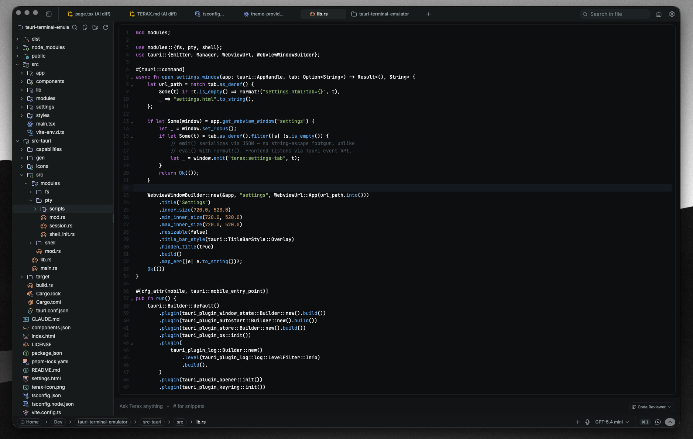

<div align="center">
  
  <h1>Terax</h1>
  <p><strong>轻量级多项目代码与文档阅读器</strong></p>
  <p>文件树 · 编辑器 · Markdown 阅读 · 集成终端</p>
</div>

---

Terax 是一个基于 Tauri 2、Rust 和 React 的极简开发阅读器。它围绕多项目工作区、文件树、文本编辑/阅读、Markdown 原文与渲染视图，以及集成终端组织功能。

产品边界明确：不提供扩展系统、LSP、代码诊断、自动格式化、网页预览或常驻后台服务。语法高亮仅用于阅读，不承担代码检查职责。

## Screenshots

<table>
  <tr>
    <td align="center"><br/><sub>代码编辑器</sub></td>
    <td align="center"><br/><sub>集成终端</sub></td>
  </tr>
  <tr>
    <td colspan="2" align="center"><br/><sub>主题与背景设置</sub></td>
  </tr>
</table>

## Features

### Workspace and file tree

- 多项目空间与多个工作区根目录
- 文件树、隐藏文件开关、文件搜索与内容搜索
- 新建、重命名、删除、复制路径、在终端打开
- 工作区级标签、当前目录和终端布局恢复

### Code and document reader

- CodeMirror 6 文本编辑器与常用语言语法高亮
- Markdown 原文编辑与渲染阅读视图
- 搜索、跳转行、自动换行、自动保存、主题和字体设置
- 二进制文件、媒体文件和超大文件使用轻量提示，不强行载入编辑器

### Integrated terminal

- Rust `portable-pty` 后端与 xterm.js/WebGL 渲染
- 多标签、水平/垂直分屏、跨平台 Shell 与 WSL 工作区
- 当前目录跟踪、前台进程保护、终端搜索、链接识别和拖拽路径
- Shell 历史记录保存与命令面板搜索

### Customization

- 应用、编辑器和终端主题
- 背景图片、字体、缩放、光标、回滚和快捷键设置
- 无遥测、无账号、无扩展运行时

## Build from source

Prerequisites: Rust stable、Node.js 22+、pnpm，以及当前平台的 Tauri 构建依赖。

```bash
pnpm install
pnpm tauri dev          # development
pnpm tauri build        # production bundle
```

Checks:

```bash
pnpm lint
pnpm check-types
pnpm test
cd src-tauri && cargo check
```

## Tech stack

Tauri 2、Rust、`portable-pty`、React 19、TypeScript、Vite、xterm.js、CodeMirror 6、Tailwind CSS、Zustand。

## Contributing

请先阅读 [CONTRIBUTING.md](CONTRIBUTING.md) 和 [架构文档索引](docs/README.md)。所有新增功能都应先验证是否属于“文件树 + 阅读器 + 终端 + 多项目工作区”的产品边界。

## License

Terax 使用 Apache-2.0 License，详见 [LICENSE](LICENSE)。
